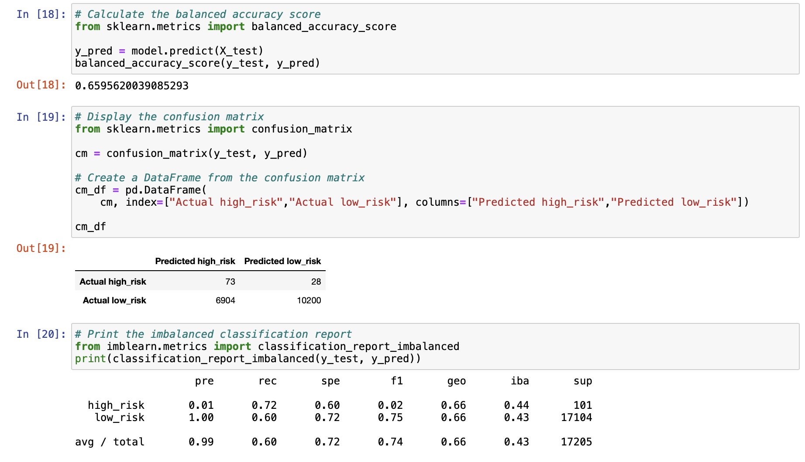
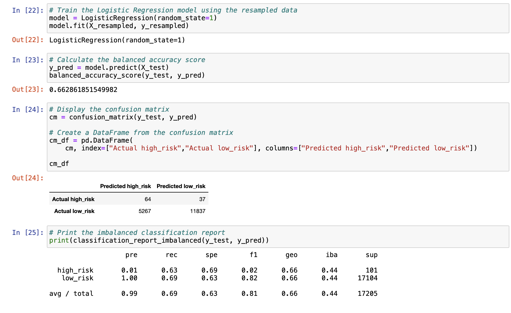
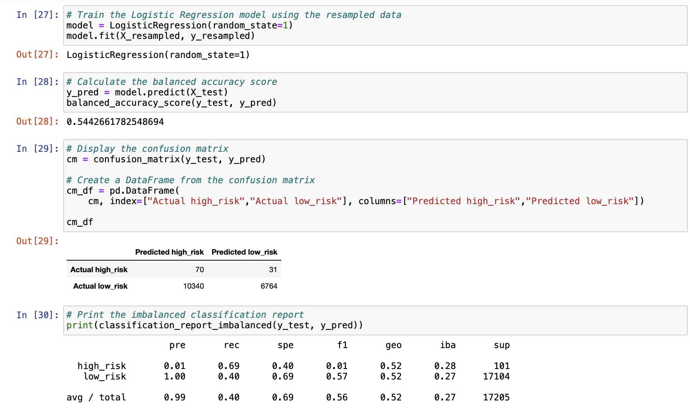
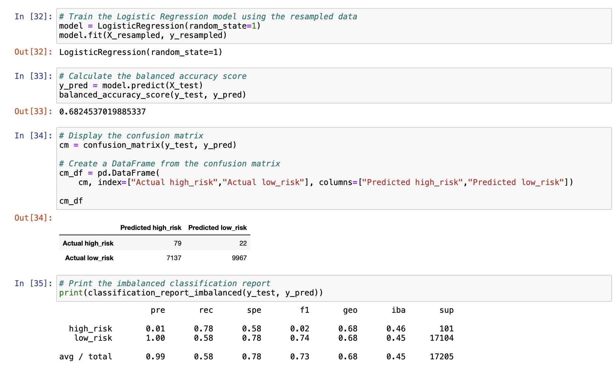
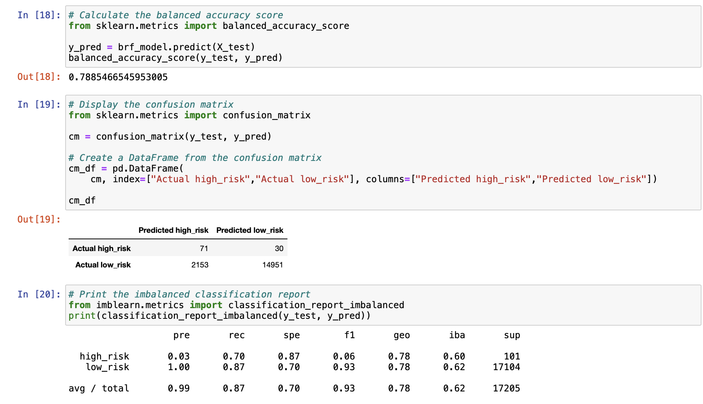
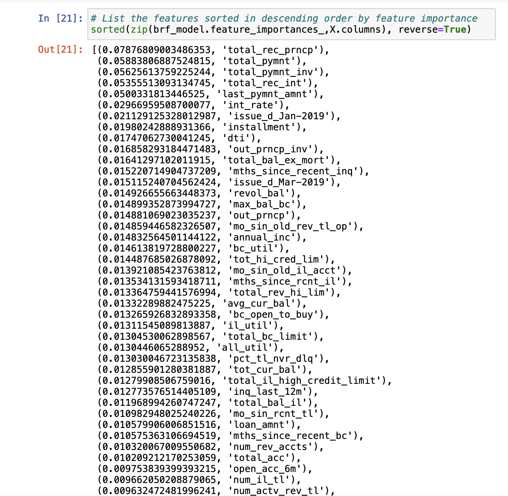
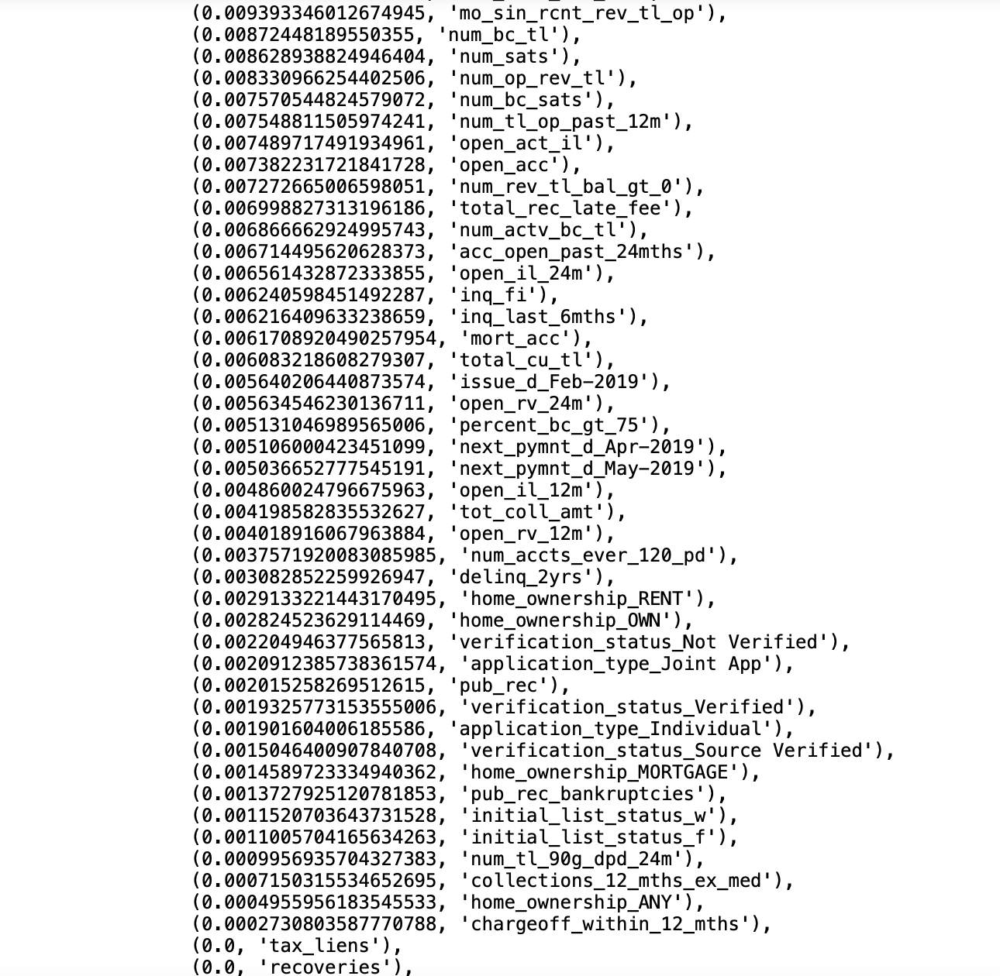
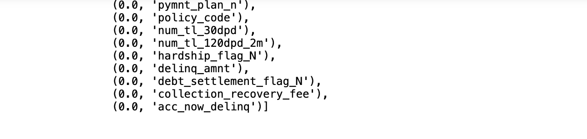
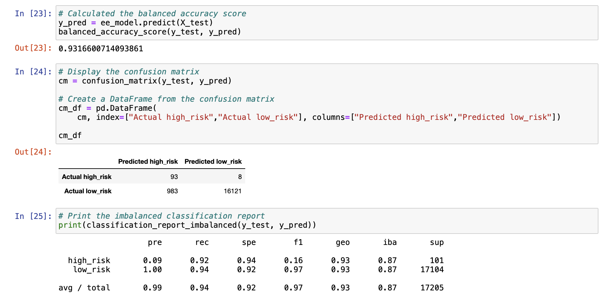

# Credit Risk Analysis
Module 17 repository

## Overview

The purpose of this analysis is to apply machine learning to predict credit card risk. Credit risk is an inherently unbalanced classification problem, as good loans easily outnumber risky loans. Therefore, the analysis employs different techniques to train and evaluate models with unbalanced classes. For this purpose, the *imbalanced-learn* and *scikit-learn* libraries were utilized to build and evaluate several models using resampling techniques.

### Methodology

This analysis is based on credit card credit datasets from *LendingClub*, a peer-to-peer lending services company. The dataset is stored as a *csv* file, *LoanStats_2019Q1.csv*, and read into a *jupyter notebook* using the *Pandas* library toolset. The dataset contains 68,817 loan records. 

Before implementing the machine learning models, the categorized data fields to be used as features were encoded into numerical values using the *get_dummies()* method. 

The target field for our prediction was *loan_status* as a proxy for credit risk   defined as a binary outcome, even though the data had more granularity to it. Low risk card loans were defined as those with *loan_status* as current in their payment. Card loans with overdue payments, including those within the grace perdiod (first 15 days), as well as those in the buckets comprised of 16-30 days overdue, 30-120 days overdue, and those in default (beyond 120 days), were defined as high risk. With this split, the data amounts to 68,470 low risk accounts and 347 hight risk accounts. 

The data was split into training and testing sets using *sklearn*'s *train_test_split()* function.

Next, the following resampling models were applied, and a Logistic Regression classifier was used to make predictions:

* oversampling using *RandomOverSample*
* oversampling using *SMOTE*
* undersampling using *CLusterCentroids*

Then, a combinatorial appraoch of over and undersampling was applied, and a Logistic Regression classifier was used to make further predictions using *SMOTEENN*.

Afterwards, utilizing the *imblearn.ensemble* toolkit library, random forest ensemble classifiers were applied with 100 estimators, using the following classifiers to make predictions:

* *BalancedRandomForestClassifier*
* *EasyEnsembleClassifier*

After each of the six classifiers were applied, an *accuracy*, *confusion matrix* and *an *imbalanced classification report* were generated for the purpose of comparison.

The analysis code is contained in two *ipynb* files included in this repository as *credit_risk_resampling.ipynb* and *credit_risk_ensemble.ipynb*.

## Results

The output reported by the models is presented in the following code sections:

### Random Oversample Classifier

### SMOTE Classifier

### Cluster Centroids Classifier

### SMOTEENN Classifier

### Balanced Random Forest Classifier

The report of feature importance is presented below, sorted in descending order (from most to least important feature), along with the feature score.

### Easy Ensemble Classifier

## Summary

As can be established from the different statistics of the models, none of the models was very good at predicting high risk card loans, although most of them had good prediction of low risk loans. The Random Forest and Ensemble models faired better in both respects than the different sampling-based models.

In addition to the models, we also ran a second set of each, changing the criteria for low and high risk. In this second run, we considered that credit card loans still in within the grace period would also be considered low-risk, in order to determine if we could improve on the model that way. After running our models, we saw a very slight improvement in the accuracy statistic, but no significant improvement in the prediction statistic for high-risk. By redefining our risk criteria, this resulted in an even smaller number of high-risk training data points (68,641 low risk and 176 high risk, which is almost half the number in the original analysis, making the problem of data balance more challenging).

The summary table below compares our findings.

Should we recommend this model? Based on the low prediction statistic for high-risk loans, it is unlikely we would recommend it. However, the relevent question is defining the desired risk appetite and establishing an acceptable balance between accurate prediction of high risk loans vs low risk loans. Choosing a model that improves the prediction of high risk loans could reducde the accuracy of predicting low-risk loans, and some good business would be sacrificed. Again, it is all a matter of defining an acceptable balance and cut-off point.
